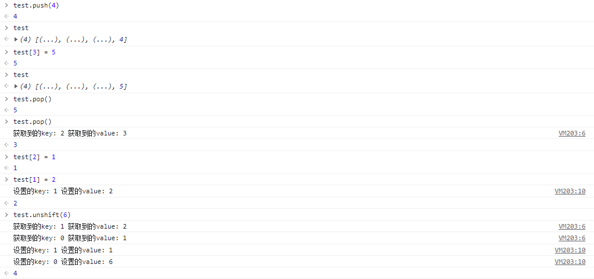
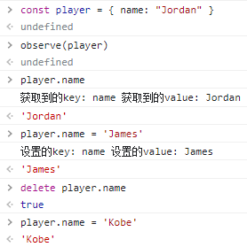

# Object.defineProperty()

## 语法

```javascript
Object.defineProperty(obj, prop, descriptor);
```

### 参数

- obj：要定义属性的对象
- prop：要定义或修改的属性的名称或 Symbol
- descriptor：要定义或修改的属性描述符
<!-- more -->

### 使用

```javascript
var obj = {};
Object.defineProperty(obj, "age", {
  value: 24,
  writable: true,
  enumerable: true,
  configurable: true,
});
//  对象 obj 拥有属性 age，值为 24
```

> 应当直接在 <a href="https://developer.mozilla.org/zh-CN/docs/Web/JavaScript/Reference/Global_Objects/Object">Object</a> 构造器对象上调用此方法，而不是在任意一个 Object 类型的实例上调用。

### 描述

> 函数的第三个参数 descriptor 所表示的属性描述符有两种形式：<b><i>数据描述符和存取描述符</i></b>。数据描述符是一个具有值的属性，该值可以是可写的，也可以是不可写的。存取描述符是由 getter 函数和 setter 函数所描述的属性。一个描述符只能是这两者其中之一；不能同时是两者。

**两者均具有以下两种键值**：

- <span style="background-color: #fff4f4; color: #c2185b; padding: 4px;">⚙️ configurable</span>
  当且仅当该属性的 configurable 为 true 时，该属性描述符才能够被改变，也能够被删除。默认为 false。
  <br/>
- <span style="background-color: #fff4f4; color: #c2185b; padding: 4px;">📄 enumerable</span>
  当且仅当该属性的 enumerable 键值为 true 时，该属性才会出现在对象的枚举属性中。 默认为 false。

**数据描述符具有以下可选键值**：

- <span style="background-color: #fff4f4; color: #c2185b; padding: 4px;">💸 value</span>
  该属性对应的值。可以是任何有效的 JavaScript 值（数值，对象，函数等）。 默认为 undefined。
  <br/>
- <span style="background-color: #fff4f4; padding: 4px;">✍ writable</span>
  当且仅当该属性的 writable 键值为 true 时，属性的值，也就是上面的 value，才能被赋值运算符改变。 默认为 false。

意思是：默认情况下，使用 Object.defineProperty() 添加的属性值是不可修改（<span style="background-color: #fff4f4; color: #c2185b; padding: 4px;">immutable</span>）的，例如我通过以下两种方式修改 defineProperty 添加的属性：

1. 如果通过 Object.defineProperty() 重新修改 Object.defineProperty() 定义过的属性，会被提示不能重复定义:Uncaught TypeError: Cannot redefine property: xxx；

```javascript
let obj = {};
Object.defineProperty(obj, "name", {
  value: "alice",
});
//{name: 'alice'}
Object.defineProperty(obj, "name", {
  value: "aaa",
});
// Uncaught TypeError: Cannot redefine property: name
```

2. 如果通过对象.属性 = xxx 的形式尝试修改用 Object.defineProperty() 新增的属性，虽然没有语法错误，但是当再次访问时，结果还是 Object.defineProperty() 之前定义的值

```javascript
let obj = {};
Object.defineProperty(obj, "name", {
  value: "alice",
});
obj.name = "tom";
console.log(obj.name); //alice
```

3. 先定义了属性的，再通过 Object.defineProperty()来修改，如果没有修改相关配置，是可以通过 对象.属性=xxx 的形式或者通过 Object.defineProperty()再次修改的

```javascript
let obj = {};
obj.name = "lbj";
console.log(obj.name); //lbj
Object.defineProperty(obj, "name", {
  value: "alice",
});
console.log(obj.name); //alice
obj.name = "tom";
console.log(obj.name); //tom
Object.defineProperty(obj, "name", {
  value: "aaa",
});
console.log(obj.name); //aaa
```

怎么会这样子呢？其实是

```javascript
obj.name = "lbj";
// 等同于：
Object.defineProperty(obj, "name", {
  value: "lbj",
  writable: true,
  configurable: true,
  enumerable: true,
});
```

**存取描述符还具有以下可选键值**：

- <span style="background-color: #fff4f4; color: #c2185b; padding: 4px;">📤 get</span>
  一个给属性提供 getter 的方法，如果没有 getter，则为 undefined。当访问该属性时，会调用此函数。执行时不传入任何参数，但是会传入 this 对象（由于继承关系，这里的 this 并不一定是定义该属性的对象）。该函数的返回值会被用作属性的值。 默认为 undefined。
  <br/>
- <span style="background-color: #fff4f4; color: #c2185b; padding: 4px;">📥 set</span>
  属性的 setter 函数，如果没有 setter，则为 undefined。当属性值被修改时，会调用此函数。该方法接受一个参数（也就是被赋予的新值），会传入赋值时的 this 对象。 默认为 undefined。

为什么**属性描述符必须是数据描述符或者存取描述符两种形式之一，不能同时是两者**？

```javascript
// 方式一
Object.defineProperty({}, "num", {
  value: 1,
  writable: true,
  enumerable: true,
  configurable: true,
});

// 方式二
var value = 1;
Object.defineProperty({}, "num", {
  get: function () {
    return value;
  },
  set: function (newValue) {
    value = newValue;
  },
  enumerable: true,
  configurable: true,
});

//报错
Object.defineProperty({}, "num", {
  value: 1,
  get: function () {
    return 1;
  },
});
```

<hr/>

## 🔎 监听对象上的多个属性

一次监听多个属性的变化我们需要配合 Object.keys(obj)进行遍历。

```javascript
Object.keys(person).forEach(function (key) {
  Object.defineProperty(person, key, {
    enumerable: true,
    configurable: true, // 默认会传入this
    get() {
      return person[key];
    },
    set(val) {
      console.log(`对person中的${key}属性进行了修改`);
      person[key] = val; // 修改之后可以执行渲染操作...
    },
  });
});
```

如果只是上面的思路与该 API 的简单结合，我们就会发现并达不到效果。看起来感觉上面的代码没有什么错误，但是试着运行一下，你会和我一样栈溢出。这是为什么呢？让我们聚焦在 get 方法里，<span style="color: #009828;">我们在访问 person 身上的属性时，就会触发 get 方法，返回 person[key]</span>，所以<span style="background-color: #fff4f4; color: #c2185b; padding: 4px;">访问 person[key]也会触发 get 方法</span>，导致递归调用，最终栈溢出。

这也引出了我们下面的方法，我们需要设置一个中转 Obsever，来让 get 中 return 的值并不是直接访问 obj[key]。

```javascript
let person = {
  name: "",
  age: 0,
};
// 实现一个响应式函数
function defineProperty(obj, key, val) {
  Object.defineProperty(obj, key, {
    get() {
      console.log(`访问了${key}属性`);
      return val;
    },
    set(newVal) {
      console.log(`${key}属性被修改为${newVal}了`);
      val = newVal;
    },
  });
}
// 实现一个遍历函数Observer
function Observer(obj) {
  Object.keys(obj).forEach((key) => {
    defineProperty(obj, key, obj[key]);
  });
}
Observer(person);
console.log(person.age); // 0
person.age = 18;
console.log(person.age); // 18
```

### 🔎 深度监听一个对象

```javascript
let person = {
  name: "child",
  age: 18,
  relationships: {
    mother: {
      name: "mother",
      age: 28,
    },
    father: {
      name: "father",
      age: 30,
    },
  },
};
function defineProperty(obj, key, val) {
  //如果某对象的属性也是一个对象，递归进入该对象，进行监听
  if (typeof val === "object") {
    Observer(val);
  }
  Object.defineProperty(obj, key, {
    get() {
      console.log(`访问了${key}属性`);
      return val;
    },
    set(newVal) {
      // 如果newVal是一个对象，递归进入该对象进行监听
      if (typeof newVal === "object") {
        Observer(key);
      }
      console.log(`${key}属性被修改为${newVal}了`);
      val = newVal;
    },
  });
}
function Observer(obj) {
  //如果传入的不是一个对象，return
  if (typeof obj !== "object" || obj === null) {
    return;
  }
  Object.keys(obj).forEach((key) => {
    defineProperty(obj, key, obj[key]);
  });
}
Observer(person);
person.relationships.mother.age = 24;
// "访问了relationships属性"
// "访问了mother属性"
// "age属性被修改为24了"
```

### 🔎 监听数组

🧐 让我们先来看看如果不通过遍历改变对象属性能检测到吗？

```javascript
var obj = {
  name: {
    firstName: "James",
    lastName: "LeBron",
  },
};
Object.defineProperty(obj, name, {
  set: function (value) {
    name = value;
    console.log("你取了一个名字叫做" + value);
  },
  get: function () {
    return "你是" + name;
  },
});
obj.name.firstName = "Harden"; // Harden
obj.name.firstName; // Harden
```

🤬 子属性变化它是检测不到

那为什么检测不到呢？有以下两种可能：

1️⃣ 对象和数组作为引用类型之所以无法被检测到是因为我们<span style="color: #009828;">存储在栈区的只是一个指向堆区的指针</span>，数据的改变不会引起指向其指针的变化，所以无法被 Object.defineProperty
2️⃣ 对象和属性变化时分几种情况，当<span style="color: #009828;">新增数据时由于属性名（索引）增加</span>而无法被 Object.defineProperty 检测到所以无法通过 Objcet.defineProperty 监测数组变化。

之所以我们无法通过`Get`和`Set`得知数组的更改，原因正是类似于上述的对象一般，`Object.defineProperty`无法检测到数组长度的变化。准确的说是无法检测到通过改变 length 而增加的长度。

再来回顾一下对象的属性类型：

**数据属性**

- `Configurable`：是否可配置，
  - 能否通过 delete 删除属性
  - 能否修改属性
  - 能否把属性修改为访问器属性
- `Enumerable`：能否通过 for-in 循环返回该属性
- `Get`：取值
- `Set`：赋值

**访问器属性**

- `Configurable`：是否可配置，
  - 能否通过 delete 删除属性
  - 能否修改属性
  - 能否把属性修改为访问器属性
- `Enumerable`：能否通过 for-in 循环返回该属性
- `Writable`：是否可写
- `Value`：属性的值

数组的 length 属性初始化为：

```javascript
enumberable: false;
configurable: false;
writable: true;
```

即，无法删除和修改（并非赋值）length 属性

```javascript
const arr = [];
Object.defineProperty(arr, "length", { set() {} });
// Uncaught TypeError: Cannot redefine property: length
```

而数组索引则是访问数组值的一种方式。若拿它与对象相比较,**索引就是数组属性的`key`**，它与`length`是 2 个不同的概念

```javascript
const a = ["a", "b", "c"];
a.length = 10; //['a', 'b', 'c', empty × 7]
// 显式的给length赋值，索引3-9的对应的value也会赋值undefined
// 但是索引3-9的key都是没有值的
// 我们可以用for-in打印，只会打印0,1,2
for (var key in a) {
  console.log(key); // 0,1,2
}
```

<span style="color: #009828;font-weight:700;">当我们给 length 赋值时，可以看见并不会遍历数组去赋值索引</span>

> JavaScript 数组的 length 属性和其数字下标之间有着紧密的联系。数组内置的几个方法（例如 join、slice、indexOf 等）都会考虑 length 的值。另外还有一些方法（例如 push、splice 等）还会改变 length 的值。

这些内置方法在操作数组时出去改变其中的内容还会影响 length 的值。分为两种情况：

- ➖ 减少值

  - 当我们 shift 一个数组时你会发现它会遍历数组。此时数组的索引对应的值得到了相应的更新。这种情况可以被 Object.defineProperty 检测到，因为有属性（索引）的存在。

- ➕ 增加值
  - push 值时，数组的长度会增加 1，索引也会增加 1.但此时的索引是新增的。虽然 Object.defineProperty 不能检测到新增的属性(push 之后 index 自增，相当于新增 key)，但是在 Vue 中，新增的对象属性可以显式的调用 vm.$set 来添加监听
  - 手动赋值 length 为一个更大的值。此时长度会更新，但对应的索引不会被赋值，即对象的属性为 null。Object.defineProperty 再强也无法处理对未知属性的监听

验证一下上面的论述：

```javascript
// 还是老套路，定义一个observe方法
function defineReactive(data, key, val) {
  Object.defineProperty(data, key, {
    enumerable: true,
    configurable: true,
    get: function defineGet() {
      console.log(`获取到的key: ${key} 获取到的value: ${val}`);
      return val;
    },
    set: function defineSet(newVal) {
      console.log(`设置的key: ${key} 设置的value: ${newVal}`);
      // 此处将新的值赋给val，保存在内存中，从而达到赋值的效果
      val = newVal;
    },
  });
}
function observe(data) {
  Object.keys(data).forEach(function (key) {
    defineReactive(data, key, data[key]);
  });
}

let test = [1, 2, 3];
// 初始化
observe(test);
```

接下来我们做如下操作


👉🏻 `push` 时，新增了索引并且改变了长度，但新索引未被 `observe`
👉🏻 修改新的索引对应的值
👉🏻 弹出新的索引对应的值
👉🏻 弹出索引被 `observe` 的值时触发了 `get`
👉🏻 此时再去给原索引赋值时发现并没有触发被 `observe` 的 `set`，由此可见数组索引被删除后就不会被 `observe` 到了
👉🏻 `unshift`时，会将索引为 0 和 1 的值遍历出来存放，然后重新赋值

🧐 那对象的属性被删除后是否还可以被 `observe` 到么？


### 💭 总结一下

对于`Object.defineProperty`来说，处理对象和数组一样，只是在初始化时去改写`get`和`set`达到监测数组或对象的变化。对于新增的属性，需要手动再初始化。

对于数组来说，只不过特别了点，某些方法例如`push`、`unshift`等也会新增索引。对于新增的索引亦可以添加`observe`从而达到监听的效果。而`pop`和`shift`则会删除更新索引，也会出发`Object.defineProperty`的`get`和`set`。对于重新赋值`length`的数组，不会新增索引，因为不清楚新增的索引数量。

> 所以在 Vue 中我们是可以显式的通过调用 vm.$set 监听对象新增的键（key）。但这样相对来讲比较损耗性能，所以尤大用了另一种 “奇技淫巧” 来保证数组的更新可以实时同步到 data 中

```javascript
const aryMethods = [
  "push",
  "pop",
  "shift",
  "unshift",
  "splice",
  "sort",
  "reverse",
];
const arrayAugmentations = [];

aryMethods.forEach((method) => {
  // 这里是原生Array的原型方法
  let original = Array.prototype[method];

  // 将push, pop等封装好的方法定义在对象arrayAugmentations的属性上
  // 注意：是属性而非原型属性!
  arrayAugmentations[method] = function () {
    console.log("我被改变啦!");

    // 调用对应的原生方法并返回结果
    return original.apply(this, arguments);
  };
});

let list = ["a", "b", "c"];
// 将我们要监听的数组的原型指针指向上面定义的空数组对象
// 别忘了这个空数组的属性上定义了我们封装好的push等方法
list.__proto__ = arrayAugmentations;
list.push("d"); // 我被改变啦！ 4

// 这里的list2没有被重新定义原型指针，所以就正常输出
let list2 = ["a", "b", "c"];
list2.push("d"); // 4
```

参考文章：
[1] [为什么 Object.defineProperty 不能检测到数组长度的变化](https://burning-shadow.github.io/2019/04/25/%E4%B8%BA%E4%BB%80%E4%B9%88Object.defineProperty%E4%B8%8D%E8%83%BD%E6%A3%80%E6%B5%8B%E5%88%B0%E6%95%B0%E7%BB%84%E9%95%BF%E5%BA%A6%E7%9A%84%E5%8F%98%E5%8C%96/)
[2] [ES6 系列之 defineProperty 与 proxy](https://juejin.cn/post/6844903710410162183)
[3] [Object.defineProperty MDN](https://developer.mozilla.org/zh-CN/docs/Web/JavaScript/Reference/Global_Objects/Object/defineProperty)

